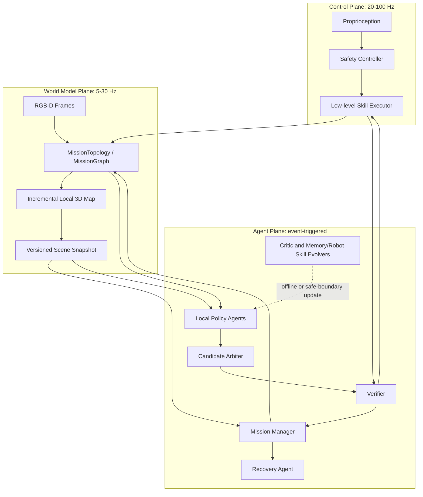

# CAP-MAS Architecture

## 1. System overview

CAP-MAS is a three-plane runtime. The planes have different timing and safety responsibilities.



## 2. Timing rule

The control plane must never wait for the agent plane. A controller consumes the newest valid scene snapshot. If the snapshot is stale or uncertain, the controller applies a configured safe response: slow, hold, retreat, or stop.

## 3. Agent roles

| Role | Produces | Authority | Cannot do |
| --- | --- | --- | --- |
| Mission Manager | `MissionGraph`, budgets, checkpoint requests | Global task decomposition and scheduling | Direct robot control |
| Perception Agent | Semantic observations, identity hypotheses, relocalization requests | Requests semantic sensing and resolves identity ambiguity | Block the control loop or claim physical success |
| Local Policy Agent | `SubgraphSpec`, grounded action candidates, or targeted visual-evidence requests | Proposes one bounded local subgraph after reading a typed mission graph | Read raw RGB-D directly, execute code, or alter world state |
| Candidate Arbiter | Selected candidate artifact | Chooses among structurally valid candidates | Bypass Verifier or acquire actuator lease |
| Verifier | Approval, rejection, postcondition report | Vetoes unsafe/stale actions | Mutate robot state |
| Executor | Execution trace and low-level state updates | Only actuator authority through a lease | Change task goals or bypass verifier |
| Recovery Agent | Recovery contract and suffix replan request | Handles classified failures | Rewrite committed history |
| Critic/Memory Evolver | Failure attribution, Memory Skill candidates, memory boundary tests | Updates memory quarantine registry and experience priors | Execute robot actions or change active memory mid-action |
| Robot Skill Evolver | Typed Robot Skill candidates, boundary tests, regression reports | Updates Robot Skill quarantine registry | Change active robot skill semantics mid-action |

The Policy Agent uses a layered multimodal input. Its default input is the
structured `SceneSnapshot`: object tracks, spatial relations, robot state,
freshness, and uncertainty. Tracks and snapshots carry references to visual
evidence such as RGB/depth crops, masks, and pose-support artifacts. The Policy
Agent may request a bounded, targeted `PerceptionRequest` when identity,
occlusion, or spatial grounding is uncertain. It never receives an embedded
raw RGB-D frame and never blocks the control plane while waiting for semantic
perception.

The Perception Agent has a different boundary: it consumes `ObservationBundle`
and camera metadata directly, runs 2D/3D inference outside the LLM path, and
publishes immutable evidence-backed scene updates. This distinction preserves
both visual grounding for high-level decisions and predictable latency for
robot control.

The LLM planning boundary supports two protocols. The legacy ablation emits a
full `MissionGraph` from the Manager and extracts local graphs from Policy
wrappers. The default staged protocol emits `MissionTopology` first, then one
direct local `SubgraphSpec` per subgoal; the runtime assembles and validates the
same final `MissionGraph` before execution.

## 4. Execution lifecycle

```text
INITIALIZE
  -> observe and publish SceneSnapshot(v)
  -> Manager creates MissionGraph/SubgraphSpec
  -> local Policy Agents propose bounded candidates
  -> GraphValidator checks graph structure, ports, checkpoints, and resources
  -> Arbiter selects one candidate
  -> candidate lowers to ActionContract(parent=v)
  -> static contract validator checks skill versions and limits
  -> Verifier checks preconditions and safety invariants
  -> Executor acquires actuator lease
  -> execute bounded action chunk
  -> publish observation and execution trace
  -> Monitor checks postconditions
       PASS: commit SceneSnapshot(v+1), advance subgoal
       FAIL: classify failure, invalidate suffix, invoke recovery
  -> task completion requires verified observable predicates
```

## 5. Topology policy

The default graph is sparse and directed:

```text
Scene Estimator -> Manager -> Policy -> Verifier -> Executor -> Monitor -> Manager
                                      \-> Recovery -> Manager
```

Additional agents are activated only on events such as perception disagreement, low confidence, repeated failure, or high novelty. Topology edits are allowed only between action chunks and must preserve a path from Manager to Verifier to Executor.

## 6. Safety invariants

1. Exactly one actuator lease exists for one physical robot.
2. No action contract executes against a stale parent scene version.
3. No unverified candidate skill is callable by the active executor.
4. Agent completion is never inferred from the string FINISH alone.
5. A reset or timeout creates a new episode epoch; old contracts become invalid.
6. Recovery never rewrites the physical history; it creates a new plan from a new observation.
