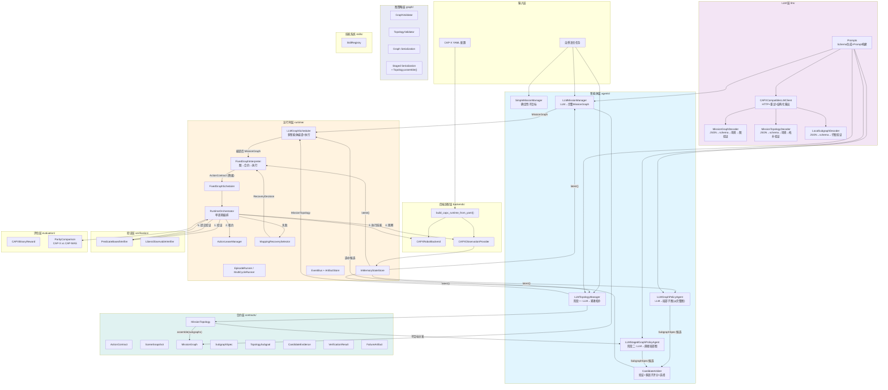
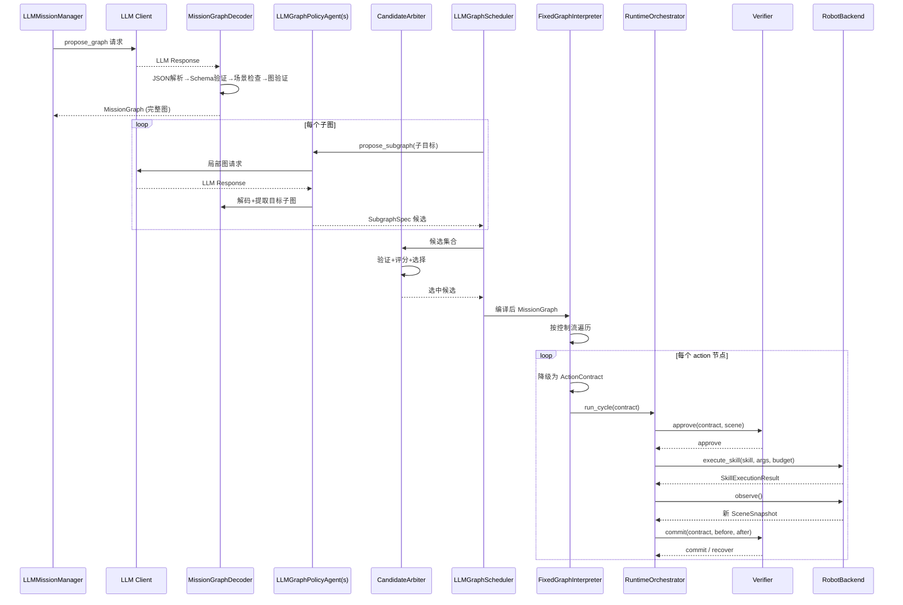
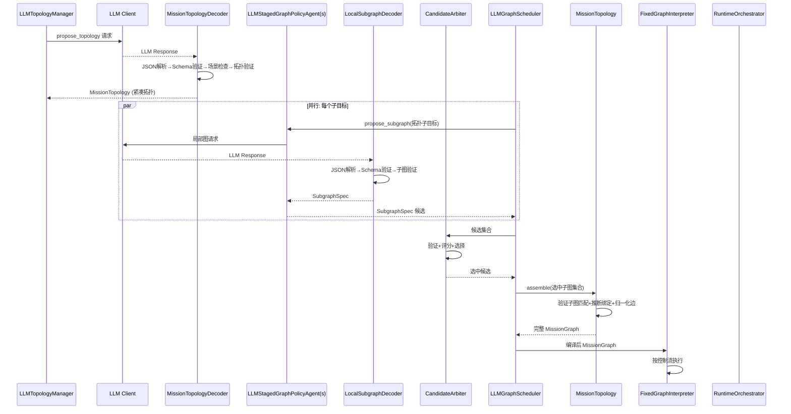
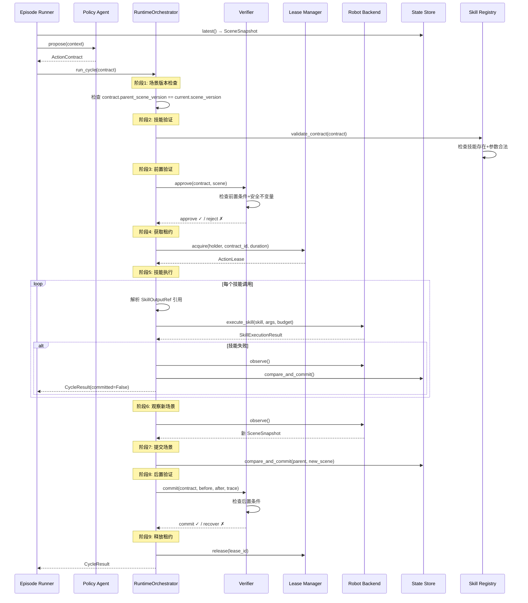
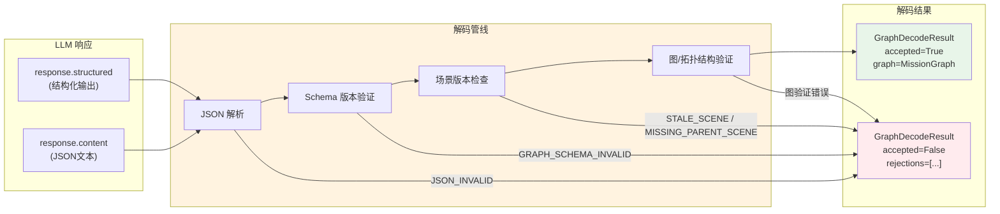
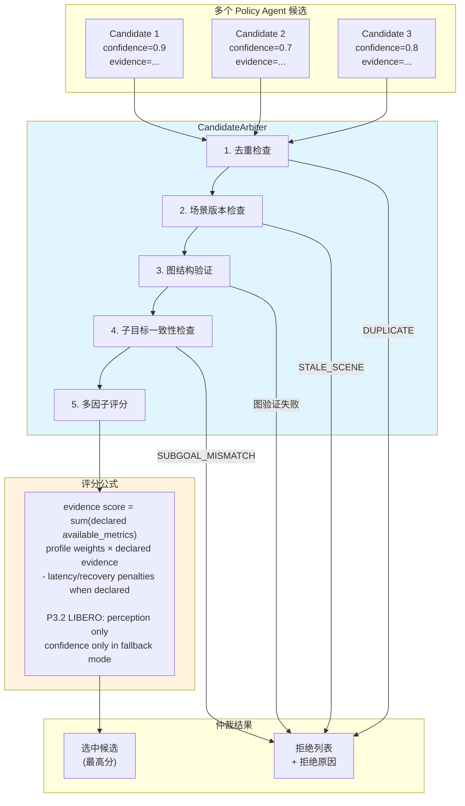
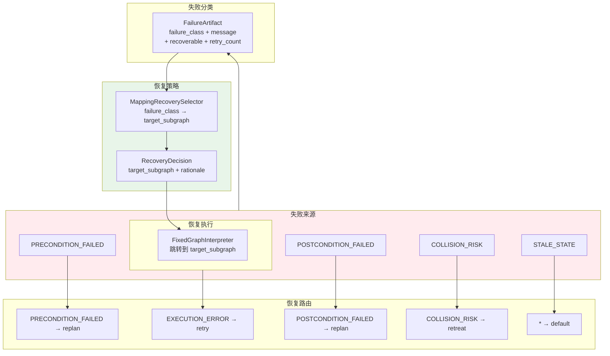

# CAP-MAS 数据流图

> 生成日期：2026-07-22

## 1. 系统整体数据流

---

## 2. Legacy 协议数据流（Manager 输出完整图）

---

## 3. Staged 协议数据流（Manager 只输出拓扑）

---

## 4. 单周期执行数据流

---

## 5. LLM 严格解码数据流

---

## 6. 候选仲裁数据流

---

## 7. 恢复数据流

---

## 8. 关键数据流不变量

| 不变量 | 保证机制 |
|--------|----------|
| 控制平面永不等待智能体平面 | 场景快照异步发布，控制器消费最新有效快照 |
| 同一时刻只有一个合约控制机器人 | ActionLeaseManager 互斥租约 |
| 场景版本单调递增 | InMemoryStateStore CAS 提交 |
| LLM 输出必须通过严格解码 | MissionGraphDecoder / MissionTopologyDecoder / LocalSubgraphDecoder |
| 候选必须通过图验证才能被选中 | CandidateArbiter 先验证后评分 |
| 失败必须分类后才能恢复 | FailureArtifact + RecoverySelector |
| 图环路必须有界 | LoopSpec.max_visits + FixedGraphInterpreter 检查 |
| 技能调用只能引用已注册技能 | SkillRegistry.validate_contract() |
